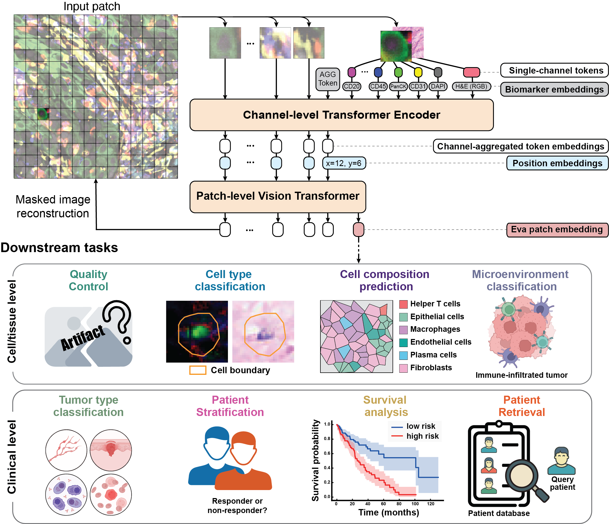

# Eva

## Overview ✨

Eva (**E**ncoding of **v**isual **a**tlas) is a foundation model for tissue imaging data that learns complex spatial representations of tissues at the molecular, cellular, and patient levels. Eva uses a novel vision transformer architecture and is pre-trained on masked image reconstruction of spatial proteomics and matched histopathology. 

### Model Architecture


## Installation ⚙️

```bash
git clone https://github.com/YAndrewL/Eva.git
cd Eva

conda env create -f env.yaml
conda activate Eva

pip install -e .  # ~10min
```

## Getting Started 🚀

| resource | link |
|---|---|
| model weights | [huggingface.co/yandrewl/Eva](https://huggingface.co/yandrewl/Eva) |
| dataset | [huggingface.co/datasets/yandrewl/Eva-data](https://huggingface.co/datasets/yandrewl/Eva-data) (gated, CC BY-NC-ND 4.0, request access on the dataset page) |
| marker embeddings | [GenePT (Zenodo record 10833191)](https://zenodo.org/records/10833191), save `GenePT_gene_protein_embedding_model_3_text.pickle` as `marker_embeddings/GenePT_embedding.pkl` |

A minimal quick start:
```python
from Eva.utils import load_from_hf, extract_features
from omegaconf import OmegaConf
import torch

conf = OmegaConf.load("config.yaml")
device = "cuda" if torch.cuda.is_available() else "cpu"
model = load_from_hf(repo_id="yandrewl/Eva", conf=conf, device=device)

patch = torch.randn(1, 224, 224, 6)
biomarkers = ["DAPI", "CD3e", "CD20", "CD4", "CD8", "PanCK"]
features = extract_features(
    patch=patch,
    bms=[biomarkers],
    model=model,
    device=device,
    cls=False,
    channel_mode="full",
)
```

## Tutorials 📓

Each notebook takes one workflow step by step, with the outputs and figures of a real run saved in
it, so GitHub shows the whole thing without you running anything. Read them in order, or jump to the
one you need. They all switch to the repository root in their first code cell, so you can run them
where they are, from the `tutorials` folder.

| tutorial | what it covers |
|---|---|
| [📦 Data download and loading](tutorials/01_data_loading.ipynb) | Getting access to `Eva-data`, downloading a region, reading the `.npz` keys, looking at patches, stitching them back into a region |
| [🚀 Basic usage and embedding generation](tutorials/02_basic.ipynb) | Loading the model from the HuggingFace Hub, marker embeddings, and patch embeddings for MIF, H&E and multi-modal inputs |
| [🧩 Masked reconstruction](tutorials/03_masked_prediction.ipynb) | Reconstruction under random, patch and channel masking, plus image translation (MIF -> H&E) |
| [🎨 Virtual staining from H&E](tutorials/04_virtual_stain.ipynb) | Loading the fine-tuned weights and predicting a whole panel from H&E (H&E -> MIF) |
| [🔬 Quality control prediction](tutorials/05_qc.ipynb) | Running the image quality (NIQE-style) and artifact heads on top of Eva features |


## Configuration 🛠️

The model requires a configuration file (YAML format) that specifies:
- Dataset parameters (patch_size, token_size, marker_dim, etc.)
- Channel mixer parameters (dim, n_layers, n_heads, etc.)
- Patch mixer parameters (dim, n_layers, n_heads, etc.)
- Decoder parameters (dim, n_layers, n_heads, etc.)

See `config.yaml` for an example configuration.


## Citation 📚
Please check Eva paper at [bioRxiv](https://www.biorxiv.org/content/10.64898/2025.12.10.693553v1), and please cite as:

```
@article {Liu2025.12.10.693553,
	author = {Liu, Yufan and Sharma, Rishabh and Bieniosek, Matthew and Kang, Amy and Wu, Eric and Chou, Peter and Li, Irene and Rahim, Maha and Bauer, Erica and Ji, Ran and Duan, Wei and Qian, Li and Luo, Ruibang and Sharma, Padmanee and Dhanasekaran, Renu and Sch{\"u}rch, Christian M. and Charville, Gregory and Mayer, Aaron T. and Zou, James and Trevino, Alexandro E. and Wu, Zhenqin},
	title = {Modeling patient tissues at molecular resolution with Eva},
	elocation-id = {2025.12.10.693553},
	year = {2025},
	doi = {10.64898/2025.12.10.693553},
	publisher = {Cold Spring Harbor Laboratory},
	URL = {https://www.biorxiv.org/content/early/2025/12/12/2025.12.10.693553},
	eprint = {https://www.biorxiv.org/content/early/2025/12/12/2025.12.10.693553.full.pdf},
	journal = {bioRxiv}
}
```